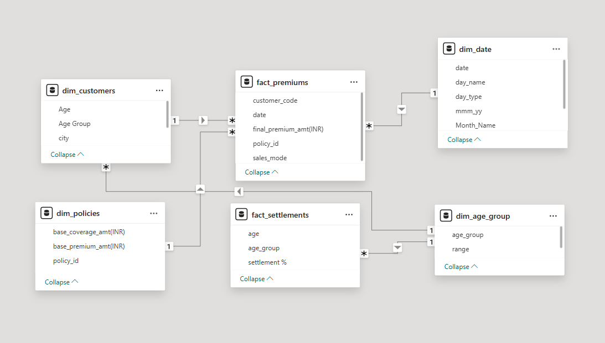
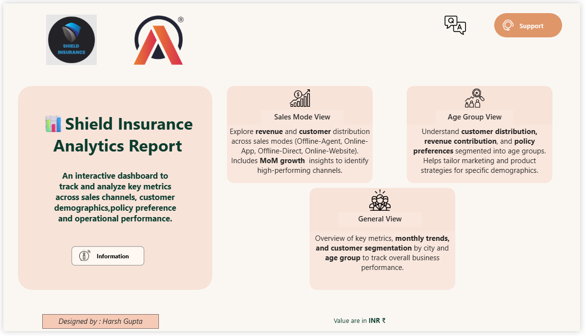
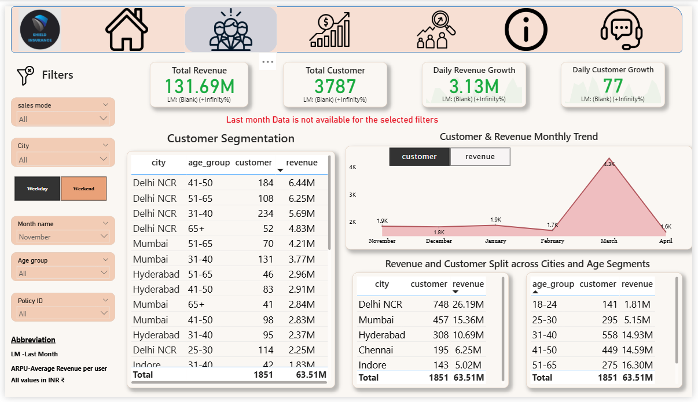
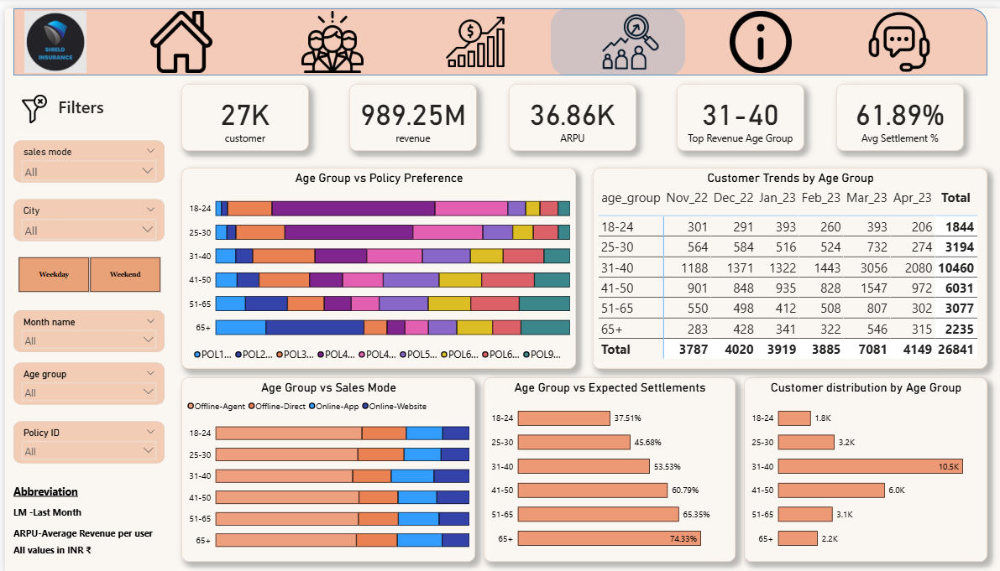
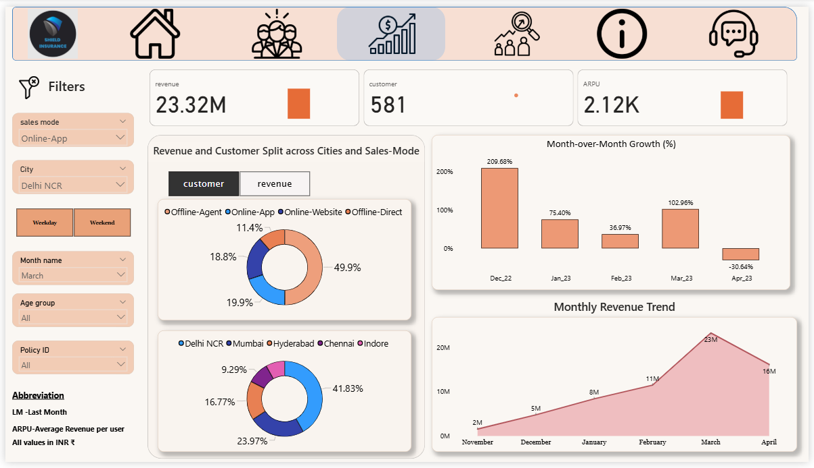
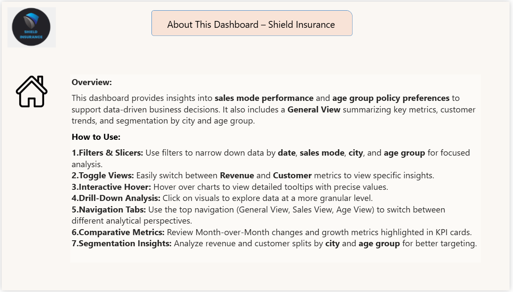
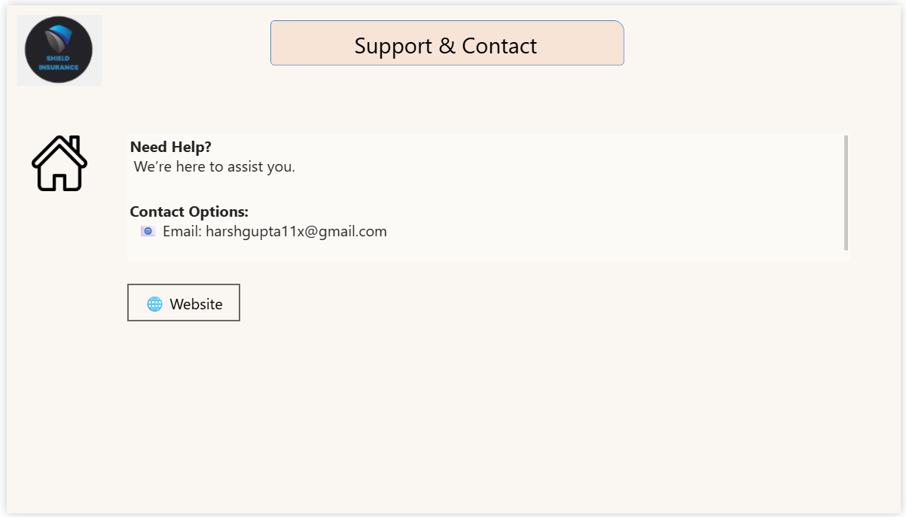

# 🛡️ Shield Insurance Analytics – Power BI Project  

## 🏢 Company: Shield Insurance  

---

## 📌 Project Overview  

Shield Insurance is a growing company that wanted to understand its **customer behavior, policy trends, revenue, and settlements** more effectively.  
This Power BI project provides a **360° business view** across customers, sales modes, and revenue growth. The dashboard enables stakeholders to take **data-driven decisions** with ease.  

🔗 [Dashboard link](https://app.powerbi.com/view?r=eyJrIjoiZjMyMjAzOGQtNTgzZi00MDM1LTk4NzEtMjI4NjRjMDI1MTc3IiwidCI6ImM2ZTU0OWIzLTVmNDUtNDAzMi1hYWU5LWQ0MjQ0ZGM1YjJjNCJ9)  
🔗 [LinkedIn Profile](https://www.linkedin.com/in/harsh-g-analyst/)  

---

## ⚙️ Tech Stack  

- 🗄️ **SQL** – Data extraction & transformation  
- 📊 **Power BI Desktop** – Dashboard development & storytelling  
- 📑 **Excel** – Data cleaning & preprocessing  
- 🧮 **DAX** – Measures, KPIs, and custom calculations  

---

## 🎓 Key Learnings & Features  

- Requirement gathering and translating into KPIs  
- Data modeling using **fact & dimension tables**  
- Designed KPIs for **Total Revenue, Customer Growth, Daily Trends**  
- Age group vs. policy segmentation  
- Sales mode performance comparison  
- Applied **filters, slicers, bookmarks & navigation** for interactivity  
- Built clean UI with consistent design for stakeholder-friendly reporting  

---

## 🧠 Business Concepts  

- **Revenue Analysis**: Total & daily growth, monthly trends  
- **Customer Insights**: Acquisition, retention, and segmentation  
- **Age Group Preferences**: Policy demand across demographics  
- **Sales Modes**: Comparing digital vs. traditional channels  
- **Settlements**: Monitoring expected vs actual settlements  

---

## 🧩 Data Model  

- **Dim Tables**:  
  - `dim_customer`  
  - `dim_date`  
  - `dim_policies`  

- **Fact Tables**:  
  - `fact_premiums`  
  - `fact_settlements`  

- **Model Type**: Star Schema 
- **Data Source**: Excel & SQL (imported into Power BI)  

📸 Data Model:  
  

---

## 📸 Dashboard Preview – Shield Insurance  

### 🏠 Home Page  
  

### 📊 General View  
  

### 👥 Age Group View  
  

### 💳 Sales Mode View  
  

### ℹ️ Information Page  
  

### 🤝 Support View  
  

---

## ❓ Problem Statement  

Shield Insurance needed a dashboard to:  
- Track **revenue & customer growth**  
- Identify **policy preferences by age group**  
- Compare **sales mode performance**  
- Segment customers by **city & demographics**  
- Monitor **settlements efficiency**  

---

## 💡 Insights  

- Revenue is increasing steadily, but **customer growth differs across age groups**.  
- **Young customers prefer digital sales**, older groups still prefer traditional.  
- Settlements show gaps between expected & actual payouts.  
- **Top cities contribute most of the revenue**, highlighting regional imbalance.  

---

## ✅ Recommendations  

- Target high-potential age groups with **customized policy offers**.  
- Strengthen **digital channels** to match younger customer demand.  
- Improve **settlement processes** to build trust and satisfaction.  
- Expand focus on **revenue-driving cities** for growth scalability.  

---

## 🎯 Project Outcome  

The Shield Insurance Dashboard provides a **single source of truth** for the company:  
- Real-time KPIs for quick decision-making  
- Clear visibility into customer & revenue trends  
- Improved operational efficiency through settlement analysis  
- Strategic direction for **marketing & sales growth**  

---

## 👨‍💻 Author  

**Harsh Gupta**  
- 🔗 [LinkedIn](https://www.linkedin.com/in/harsh-g-analyst/)  
- 🌐 [Portfolio Website](https://codebasics.io/portfolio/Harsh-gupta)  

---
